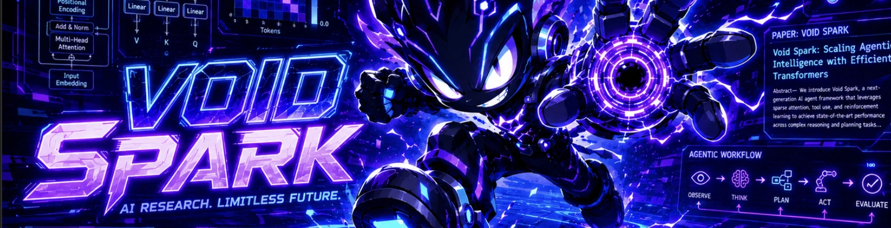

# VoidSpark

**A localhost autonomous-research loop you point at your own code.**

VoidSpark mines research ideas, gate-reviews them, implements each behind a
config flag, runs the A/B on your GPU, judges the result against a variance band,
and queues the next one — unattended. It runs entirely on your machine, with your
API keys and your hardware. Nothing leaves your box.

> Status: early extraction (M0). You point it at one local research repo today;
> the generic adapter layer that will let it drive *any* repo with one config
> file is in progress — see [Roadmap](#roadmap).

## Set it up with an AI agent (easiest)

Have an AI coding agent (Claude Code, Codex, Cursor, …) do the setup for you.
Paste this prompt into your agent:

```
Clone https://github.com/vukrosic/voidspark and read AGENT.md in the repo,
then set it up on my machine following those instructions.
```

[AGENT.md](AGENT.md) is a runbook the agent follows: it checks prerequisites,
installs deps, configures `.env.local`, helps you pick a target research repo,
and starts the dashboard — asking you only for the few things it can't determine
(your API key, which repo to drive).

Prefer to do it by hand? Follow the manual steps below.

## First run

```bash
npm install
cp .env.local.example .env.local   # optional — see Environment below
npm run dev
```

Open [http://localhost:3000](http://localhost:3000). On a fresh clone the dashboard
shows an **onboarding card** — add the absolute path to the research repo you
want VoidSpark to drive. Don't have one? Clone the reference target
[universe-lm](https://github.com/vukrosic/universe-lm) and point VoidSpark at it.

Then open **Settings** (gear, top-right) → **GPU box (Vast.ai)** and paste the
SSH command your GPU host gives you, e.g.:

```
ssh -p 52674 root@1.2.3.4
```

VoidSpark parses the host/port/user into the repo's
`autoresearch/remote-box.json` — no JSON editing. When you rent a new instance,
just paste the new command.

From there the whole app is one page: generate ideas, implement them, queue GPU
A/Bs, and read verdicts as the loop runs.

### Environment

Everything in `.env.local` is optional — you can configure the repo (onboarding
card) and GPU box (Settings) entirely from the UI. To seed them up front:

```
VOIDSPARK_TARGET_REPO=         # abs path to the repo to drive (seeds the registry)
AGENT_LAUNCHER=                # optional: override the vendored scripts/launch_agent.sh
CODEX_MODEL=                   # optional: default gpt-5.4-mini
MINIMAX_API_KEY=               # optional: enables MiniMax as a runner + its quota readout
NEXT_PUBLIC_GPU_SERVER_URL=    # optional: GPU status endpoint
CONVEX_DEPLOYMENT=             # optional
NEXT_PUBLIC_CONVEX_URL=        # optional
```

Your **coding agent authenticates itself** — log in with its own CLI, or, if it
reads a key from the environment, put that key here and VoidSpark passes it
through to the agent. VoidSpark never reads your agent's key directly.

### Requirements

- Node 20+, `tmux` (agents run in detached tmux sessions)
- A coding agent CLI on PATH (e.g. `claude` or `codex`), already authenticated.
  The tmux launcher ships vendored in [`scripts/launch_agent.sh`](scripts/launch_agent.sh) —
  no external skill install needed.
- A target research repo + (optionally) a GPU box. The reference target is
  [universe-lm](https://github.com/vukrosic/universe-lm).

## How it works

The pipeline is a self-driving loop over an idea's `status` frontmatter:

```
taste → definition → implement → run → done
                                   └─ crashed → recode → run
```

Each stage is an agent reading a prompt; `flip.sh` advances the status; the
dashboard reads the queue live. There is no code-review gate — the implementer
owns correctness, and a crashed run bounces back to it.

## The engine vs. your repo

Two separate things — keeping this seam clean is the whole design:

| | VoidSpark (the engine) | The research repo (the target) |
|---|---|---|
| What | dashboard + queue + pipeline + agent prompts + state machine | the actual model/training code the experiments mutate |
| Generic? | yes — knows nothing about transformers | no — this is *your* codebase |
| Example | this repo | [universe-lm](https://github.com/vukrosic/universe-lm) |
| Ships in VoidSpark? | yes, the core | no — you bring your own, or clone the example |

The engine reads and writes one source of truth: the `status` / `round` /
`updated` frontmatter in the target repo's idea folders. Everything else hangs
off that.

## Philosophy

**Localhost-only is the feature, not a limitation.** Your keys, your GPU, your
data — nothing leaves your box. That's the whole trust story: you can point this
at unpublished research and never wonder where it went.

## Roadmap

- **M0 — Standalone repo (now).** Clone & run on localhost against one local
  research repo. De-hardcoded paths, in-app onboarding + GPU-box setup.
- **M1 — Adapter seam.** Three small interfaces so the engine knows nothing about
  any specific codebase:
  - **RepoAdapter** — turn an idea into runnable code (file layout, the flag
    convention, a cheap build/smoke check).
  - **ComputeAdapter** — where a run happens (`local`, or `ssh` to your
    Vast/remote box — generalizes today's `remote-box.json`).
  - **Scorer** — parse the metric from a run and return WIN / NULL / FAIL against
    a variance band.
- **M2 — `voidspark.config.ts` + `init` CLI.** A second target repo proves the
  adapter works on something that isn't the example.
- **M3 — Public launch.** Docs + a short "watch it run" demo.

Distribution is repo-first (clone & fork); an `npx voidspark init` CLI and an npm
package come later, once the adapter API stops moving.

## License

[MIT](LICENSE) — maximally permissive. Fork it, ship it, build on it.
